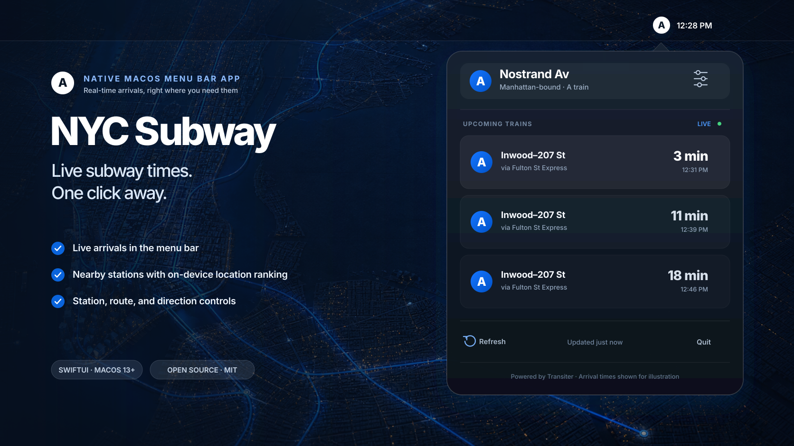

<h1 align="center">NYC Subway</h1>

<p align="center">
  Live NYC subway arrivals, one click from your Mac's menu bar.
</p>

<p align="center">
  
  
  
  <a href="LICENSE"></a>
</p>



NYC Subway is a small, native SwiftUI app that keeps live train times close without adding another window or Dock icon. It opens at Nostrand Avenue's Manhattan-bound A train by default, then lets you switch stations, routes, or direction whenever your plans change.

## Highlights

- **Live at a glance.** See the next six arrivals and minute-by-minute countdowns from the menu bar.
- **Made for your route.** The status icon changes to match the selected train.
- **Any NYC subway station.** Search the complete station catalog and filter by route or direction.
- **Nearby when you want it.** Use a one-shot location fix to find close stations, with the ranking performed locally.
- **Quiet by design.** Preferences persist between launches, arrivals refresh every 30 seconds while open, and the app stays out of the Dock.
- **Small dependency surface.** The app uses Apple's frameworks and Swift Package Manager with no third-party runtime packages.

## Quick start

You need macOS 13 or newer and the Xcode Command Line Tools.

```sh
git clone https://github.com/marcdacosta/mac-subway-times.git
cd mac-subway-times
make test
make run
```

`make run` creates an ad-hoc-signed app at `.build/NYC Subway.app` and opens it. Look for the circular train badge beside the clock in the menu bar.

> [!NOTE]
> The project currently ships as source. A future public binary release should be Developer ID signed and notarized before distribution.

### Keep it installed

After running `make app`:

1. Copy `.build/NYC Subway.app` to `/Applications`.
2. Open the copied app once.
3. To launch it when you sign in, add **NYC Subway** under **System Settings → General → Login Items**.

## Using the app

Click the route badge to see upcoming arrivals. Open the sliders control to:

- use your current location or choose a nearby station;
- search all subway stations by name;
- show every route at a station or select one train; and
- switch between northbound and southbound service.

Your station, route, and direction are saved between launches. Nostrand Avenue (`A46`), the A train, and northbound service are the defaults.

## Location and privacy

NYC Subway only requests location after you click **Use Current Location**. It downloads the station catalog, asks Core Location for a one-shot fix, and calculates nearby stations on your Mac. Your coordinates are not sent to Transiter.

Macs estimate location primarily from nearby Wi-Fi networks rather than GPS. In New York City that is generally useful for ranking nearby stations, but it may be coarse or unavailable—especially on desktop Macs, Ethernet-only connections, or with Wi-Fi disabled. Manual station selection always remains available.

macOS controls permission under **System Settings → Privacy & Security → Location Services** and may show a location indicator during the request.

## Arrival data

The app reads Transiter's JSON API for the selected parent station:

```text
https://demo.transiter.dev/systems/us-ny-subway/stops/{stationID}
```

[Transiter](https://github.com/jamespfennell/transiter) turns the MTA's static GTFS and GTFS-realtime feeds into a straightforward API. NYC Subway orders future departures, applies the route and direction filters, and refreshes while the popover is open.

The public Transiter demo is best-effort and convenient for development. A durable binary release should use [a Transiter instance operated by the distributor](https://docs.transiter.dev/deployment/) or another production-grade endpoint.

## Development

```sh
swift build
swift test
make app
```

The package has two main targets:

- `NostrandCore` handles Transiter requests, decoding, and arrival filtering.
- `NostrandMenuBar` handles the SwiftUI menu-bar interface, location, persistence, and refresh state.

Please open an issue before a large change. Focused bug fixes and improvements are welcome; include tests for changes to decoding or arrival filtering.

## License

NYC Subway is available under the [MIT License](LICENSE).

This project is independent and is not affiliated with or endorsed by the Metropolitan Transportation Authority.
