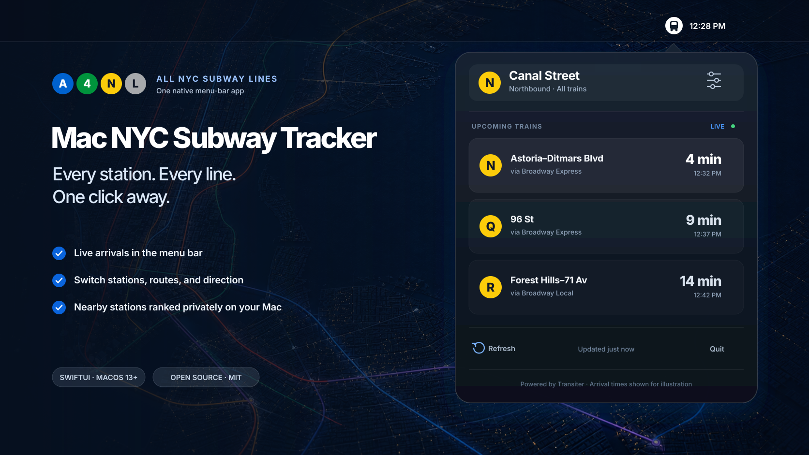

<h1 align="center">Mac NYC Subway Tracker</h1>

<p align="center">
  Live arrivals for any NYC subway station, one click from your Mac's menu bar.
</p>

<p align="center">
  
  
  
  <a href="LICENSE"></a>
</p>



Mac NYC Subway Tracker is a small, native SwiftUI app that keeps live train times close without adding another window or Dock icon. It works across the subway system: choose a home station or let the app follow this Mac and automatically show the nearest station.

## Highlights

- **Live at a glance.** See the next six arrivals and minute-by-minute countdowns from the menu bar.
- **Made for your route.** The status icon changes to match the selected train.
- **Any NYC subway station.** Search the complete station catalog and filter by route or direction.
- **Follows your Mac.** Automatic mode keeps the nearest station current as macOS reports location changes.
- **Private by design.** Station ranking happens locally; coordinates are never sent to Transiter.
- **Quiet by design.** Your mode and filters persist, arrivals refresh every 30 seconds while open, and the app stays out of the Dock.
- **Small dependency surface.** The app uses Apple's frameworks and Swift Package Manager with no third-party runtime packages.

## Quick start

You need macOS 13 or newer and the Xcode Command Line Tools.

```sh
git clone https://github.com/marcdacosta/mac-nyc-subway-tracker.git
cd mac-nyc-subway-tracker
make test
make run
```

`make run` creates an ad-hoc-signed app at `.build/Mac NYC Subway Tracker.app` and opens it. Look for the circular train badge beside the clock in the menu bar.

> [!NOTE]
> The project currently ships as source. A future public binary release should be Developer ID signed and notarized before distribution.

### Keep it installed

After running `make app`:

1. Copy `.build/Mac NYC Subway Tracker.app` to `/Applications`.
2. Open the copied app once.
3. To launch it when you sign in, add **Mac NYC Subway Tracker** under **System Settings → General → Login Items**.

## Using the app

The first launch asks how the app should choose a station:

- **Use Nearest Station** keeps Core Location active while the app is running and changes stations as this Mac moves.
- **Choose a Home Station** pins a station until you select another one.

Click the menu-bar badge to see arrivals. The sliders control lets you switch station mode, search stations, show all trains or one route, and change direction. These choices persist between launches. There is no hard-coded home station or train line.

## Location and privacy

Automatic mode starts after you explicitly choose **Use Nearest Station**. While the app is running, Core Location reports meaningful location updates and the app recalculates the nearest station from its downloaded catalog. The chosen mode persists, so automatic location starts again on later launches.

Coordinates stay on your Mac and are not sent to Transiter. Turning automatic mode off keeps the current station as your home station and stops location updates.

Macs estimate location primarily from nearby Wi-Fi networks rather than GPS. In New York City that is generally useful for choosing a nearby station, but it may be coarse or unavailable—especially on desktop Macs, Ethernet-only connections, or with Wi-Fi disabled. It should not be trusted to choose an entrance, platform, or travel direction; those controls remain manual.

macOS controls permission under **System Settings → Privacy & Security → Location Services** and may show a location indicator while automatic mode is active.

## Arrival data

The app reads Transiter's JSON API for the selected parent station:

```text
https://demo.transiter.dev/systems/us-ny-subway/stops/{stationID}
```

[Transiter](https://github.com/jamespfennell/transiter) turns the MTA's static GTFS and GTFS-realtime feeds into a straightforward API. Mac NYC Subway Tracker orders future departures, applies the route and direction filters, and refreshes while the popover is open.

The public Transiter demo is best-effort and convenient for development. A durable binary release should use [a Transiter instance operated by the distributor](https://docs.transiter.dev/deployment/) or another production-grade endpoint.

## Development

```sh
swift build
swift test
make app
```

The package has two main targets:

- `MacNYCSubwayTrackerCore` handles Transiter requests, decoding, station ranking, and arrival filtering.
- `MacNYCSubwayTrackerMenuBar` handles the SwiftUI menu-bar interface, onboarding, location monitoring, persistence, and refresh state.

Please open an issue before a large change. Focused bug fixes and improvements are welcome; include tests for changes to decoding or arrival filtering.

## License

Mac NYC Subway Tracker is available under the [MIT License](LICENSE).

This project is independent and is not affiliated with or endorsed by the Metropolitan Transportation Authority.
